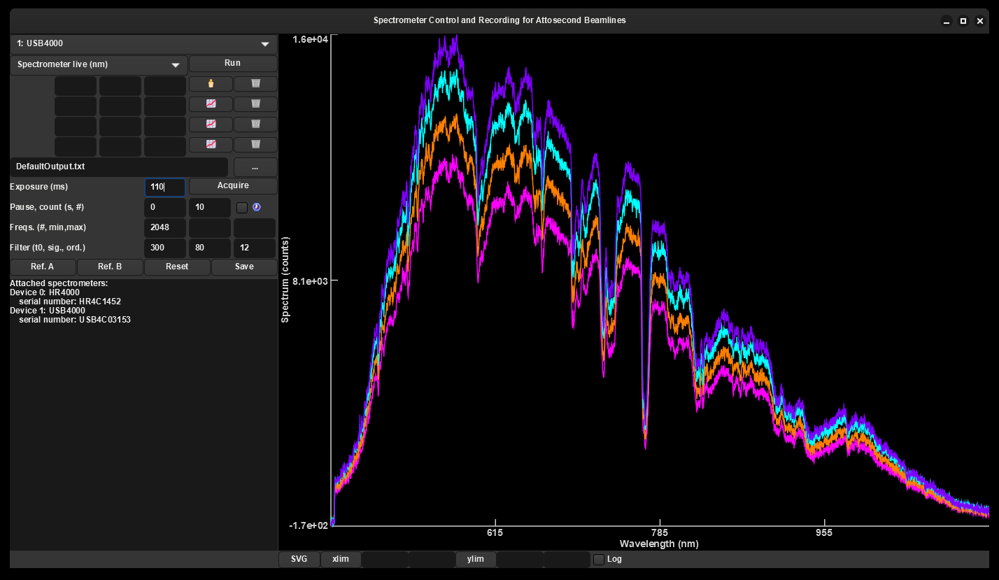

## 
Scarab

Spectrometer Control and Recording for Attosecond Beamlines

Nick Karpowicz

Max Planck Institute of Quantum optics

This is a simple c++ application for controlling spectrometers from Ocean Insight (nee Ocean Optics).

GUI with GTK4, should work on Linux, Mac, and Windows, but only tested on Windows so far.

